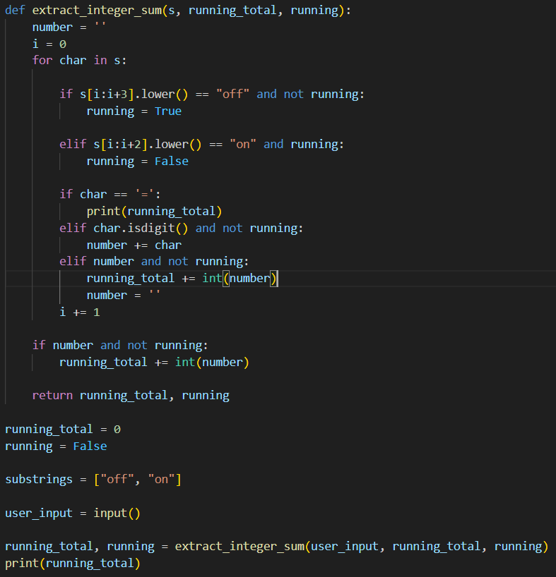

Título: TPC1: Somador on/off simples

Autor: Tiago Manuel da Silva Rego Macedo Alves, A8087

Resumo:
. Some todas as sequências de dígitos que encontre num texto;
. Sempre que encontrar a string “Off” em qualquer combinação de maiúsculas e minúsculas, esse
comportamento é desligado;
. Sempre que encontrar a string “On” em qualquer combinação de maiúsculas e minúsculas, esse
comportamento é novamente ligado;
. Sempre que encontrar o caráter “=”, o resultado da soma é colocado na saída;
. No fim, coloca o valor da soma na saída.

Lista de Resultados:

