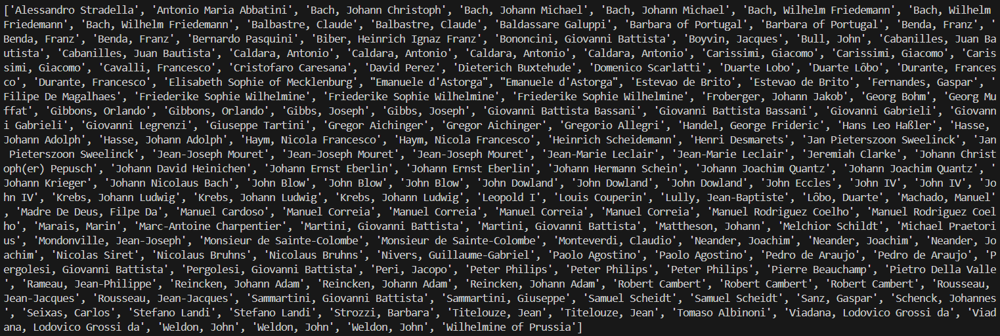
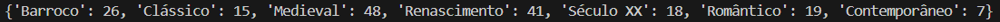
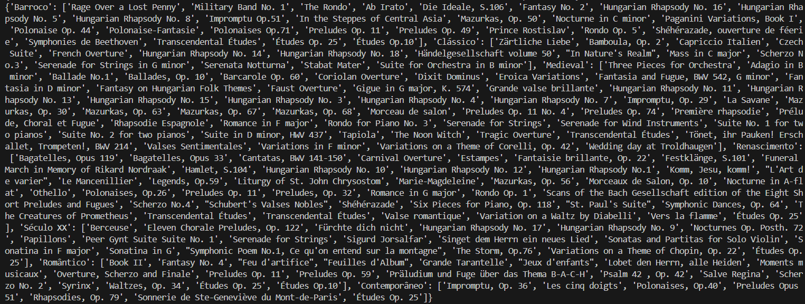

Título: TPC2: Análise de um dataset de obras musicais

Autor: Tiago Manuel da Silva Rego Macedo Alves, A8087

Resumo:
. Neste TPC, é proibido usar o módulo CSV do Python;
. Deverás ler o dataset, processá-lo e criar os seguintes resultados:
    . Lista ordenada alfabeticamente dos compositores musicais;
    . Distribuição das obras por período: quantas obras catalogadas em cada período;
    . Dicionário em que a cada período está a associada uma lista alfabética dos títulos das obras
    . desse período

Lista de Resultados:

