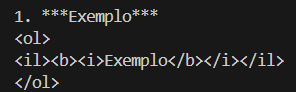
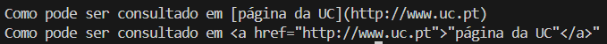
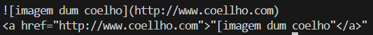

Título: TPC3: Conversor de MarkDown para HTML

Autor: Tiago Manuel da Silva Rego Macedo Alves, A8087

Resumo:
. Criar em Python um pequeno conversor de MarkDown para HTML para os elementos descritos na "Basic
Syntax" da Cheat Sheet

Lista de Resultados:

